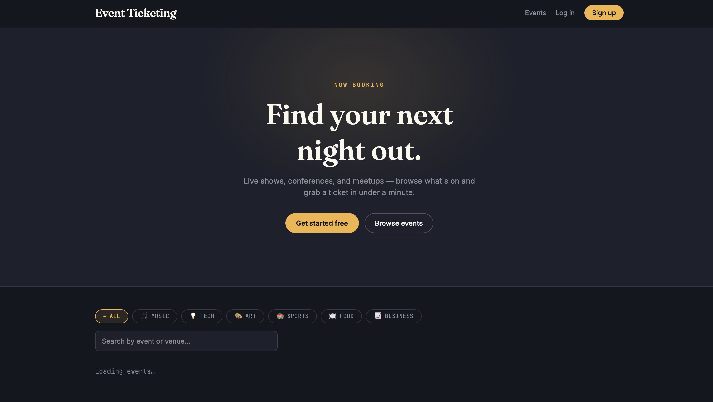
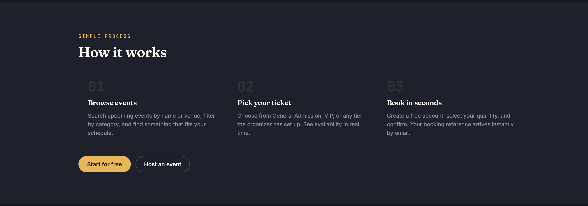
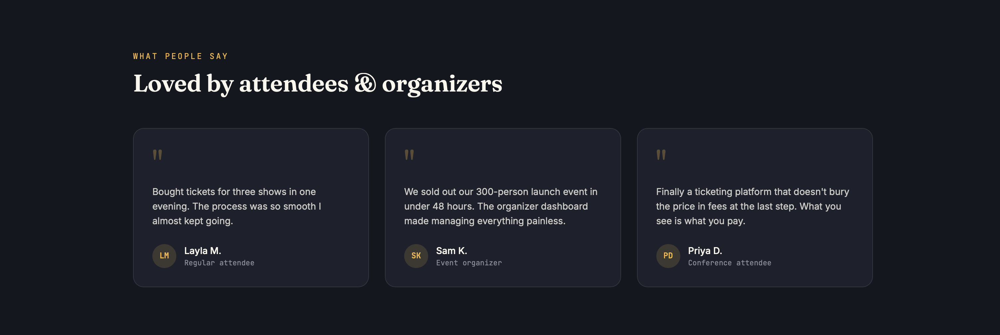
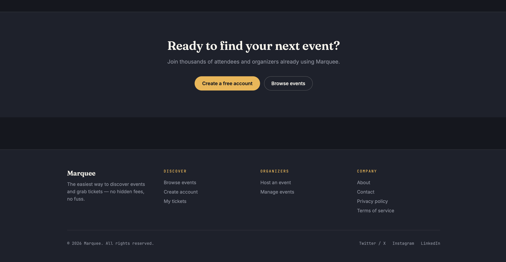

# 🎟️ Event Ticketing Platform

A modern, full-stack event management and ticketing platform built with **Laravel** (API backend) and **React** (frontend). Create events, sell tickets, manage bookings — all in one place.

---

## 📸 UI Preview








---

## ✨ Features

| Feature | Description |
|---|---|
| 🔐 **Authentication** | Register, login, logout with Laravel Sanctum token auth |
| 👥 **Three user roles** | Attendee, Organizer, Admin — each with different permissions |
| 📅 **Event management** | Create, edit, publish, and cancel events with cover images |
| 🎫 **Ticket types** | Multiple ticket tiers per event (General, VIP, etc.) |
| 🔒 **Safe booking** | Row-level DB lock prevents overselling under concurrent traffic |
| 📧 **Email confirmation** | Booking confirmation email sent automatically on purchase |
| 🔍 **Search & filter** | Search events by name or venue, filter by category |
| 📊 **Admin panel** | Platform stats, revenue overview, recent bookings, user management |
| 📱 **Responsive design** | Mobile-first UI, works on all screen sizes |
| 🎟️ **Ticket stub UI** | Unique perforated ticket-stub card design throughout |

---

## 🛠️ Tech Stack

| Layer | Technology |
|---|---|
| **Backend** | Laravel 11, PHP 8.2+, Laravel Sanctum |
| **Frontend** | React 18, Vite, Tailwind CSS v4 |
| **Database** | MySQL (or SQLite for local dev) |
| **Auth** | Token-based via Laravel Sanctum |
| **Email** | Laravel Mailable + queue |
| **HTTP Client** | Axios |
| **Routing** | React Router v6 |

---

## 🚀 Quick Start

### Backend (Laravel API)

Requires **PHP 8.2+**, **Composer**, and **MySQL**.

```bash
cd backend
composer install
cp .env.example .env
php artisan key:generate

# Create database, then:
php artisan migrate --seed
php artisan serve --port=8000
```

### Frontend (React)

Requires **Node 18+**.

```bash
cd frontend
npm install
cp .env.example .env
# Edit .env → set VITE_API_URL=http://127.0.0.1:8000/api
npm run dev
```

Open **http://localhost:5173** in your browser.

---

## 👤 Demo Accounts

The seeder creates three ready-to-use accounts (password for all: `password`):

| Role | Email | Access |
|---|---|---|
| **Admin** | admin@example.com | Full platform access |
| **Organizer** | organizer@example.com | Create & manage events |
| **Attendee** | attendee@example.com | Browse & book tickets |

> On the login page, click any demo account button to log in instantly without typing.

---

## 📁 Project Structure

```
event-platform/
├── backend/
│   ├── app/
│   │   ├── Http/Controllers/Api/     # Auth, Events, Bookings, Admin
│   │   ├── Http/Requests/            # Form validation
│   │   ├── Http/Resources/           # API response shaping
│   │   ├── Mail/                     # Booking confirmation email
│   │   └── Models/                   # User, Event, TicketType, Booking
│   ├── database/
│   │   ├── migrations/               # All table schemas
│   │   └── seeders/                  # Demo data seeder
│   └── routes/api.php                # All API routes
│
└── frontend/
    └── src/
        ├── api/client.js             # Axios instance
        ├── components/               # Navbar, Footer, EventCard, Guards
        ├── context/AuthContext.jsx   # Global auth state
        └── pages/                    # All page components
```

---

## 🔌 Key API Endpoints

```
POST  /api/auth/register
POST  /api/auth/login
GET   /api/auth/me

GET   /api/events                  # Public event listing
GET   /api/events/{slug}           # Event detail
POST  /api/events                  # Create event (organizer/admin)
PUT   /api/events/{event}          # Update event
DELETE /api/events/{event}         # Delete event

POST  /api/events/{event}/ticket-types    # Add ticket type
POST  /api/bookings                       # Book tickets
GET   /api/my/bookings                    # My bookings
DELETE /api/bookings/{id}                 # Cancel booking

GET   /api/admin/stats                    # Admin dashboard stats
GET   /api/admin/users                    # All users
PATCH /api/admin/users/{id}/role          # Change user role
```

---

## 🌍 Deployment

| Service | Platform |
|---|---|
| **Frontend** | Vercel, Netlify (free) |
| **Backend** | Railway, Render (free tier) |
| **Database** | Railway MySQL, PlanetScale (free) |

```bash
# Frontend build
cd frontend && npm run build
# Deploy the dist/ folder to Vercel or Netlify

# Backend — set these env vars on your host:
APP_ENV=production
APP_KEY=your-key
DB_CONNECTION=mysql
FRONTEND_URL=https://your-frontend-domain.com
```

---

## 📋 Roadmap

- [ ] Stripe / PayPal payment integration
- [ ] QR code ticket generation
- [ ] Event image file upload
- [ ] Waitlist for sold-out events
- [ ] Automated test suite (PHPUnit + Vitest)
- [ ] Mobile app (React Native / Flutter)

---

## 📄 License

MIT License — free to use, modify, and distribute.
